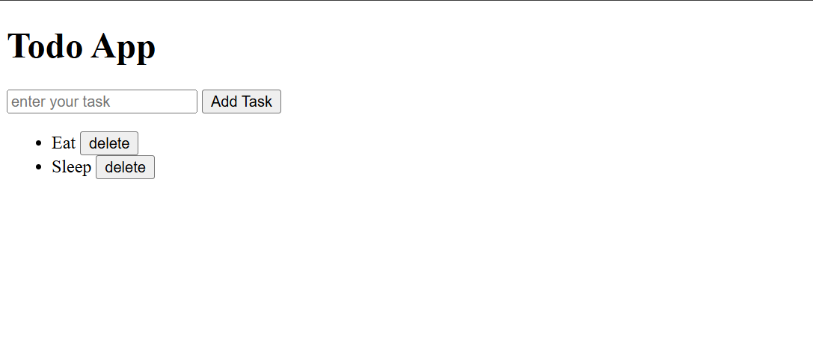
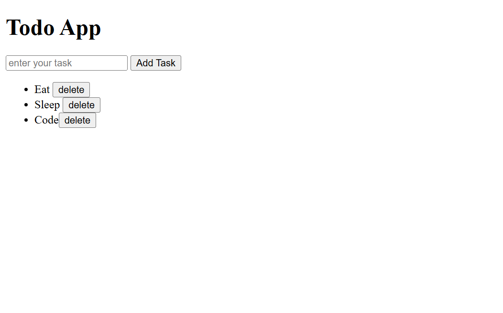

# 🧾 Todo App (JavaScript Mini Project)

This is a simple **To-Do List App** built using **HTML, CSS, and JavaScript**.  
It allows users to **add** and **delete** tasks dynamically — no backend required!

---

## 🚀 Features
- ✏️ Add new tasks easily  
- 🗑️ Delete tasks with one click  
- 🎨 Minimal and clean interface  
- ⚡ Built using pure JavaScript (no frameworks)

---

## 🧰 Tech Stack
- **HTML** – Structure of the app  
- **CSS** – Basic styling  
- **JavaScript (DOM)** – Functionality to add and delete tasks

---

## 📸 Screenshots

### ▶️ Interface


### ▶️ After Adding a Task


---

## 🧠 How It Works
1. Enter your task in the input field  
2. Click **Add Task**  
3. Your task will appear in the list with a **delete** button  
4. Click **delete** to remove the task

---

## 🏗️ Folder Structure
todo-app-js-mini-project/
│
├── index.html # main HTML file
├── JS-MiniProject.css # CSS styling file
├── JS-MiniProject.js # JavaScript logic file
└── README.md # project documentation


---

## 💡 Concepts Used
- DOM Manipulation (`createElement`, `appendChild`, `addEventListener`)
- Event Delegation
- Element Removal (`remove()` method)

---

## 🧑‍💻 Author
**Digvej**  
🎓 B.Tech CSE | JavaScript Enthusiast | Learning Frontend  

---

## 📬 How to Run
1. Clone the repository  
   ```bash
   git clone https://github.com/digvej/todo-app-js-mini-project.git

